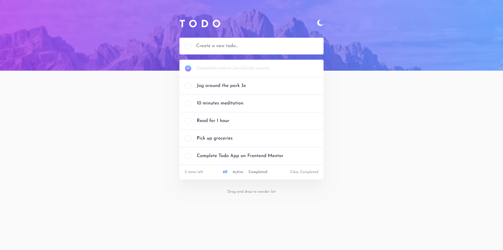

# Frontend Mentor - Todo app solution

This is a solution to the [Todo app challenge on Frontend Mentor](https://www.frontendmentor.io/challenges/todo-app-Su1_KokOW). Frontend Mentor challenges help you improve your coding skills by building realistic projects.

## Table of contents

- [Overview](#overview)
  - [The challenge](#the-challenge)
  - [Screenshot](#screenshot)
  - [Links](#links)
- [My process](#my-process)
  - [Built with](#built-with)
  - [What I learned](#what-i-learned)
  - [Continued development](#continued-development)
  - [Useful resources](#useful-resources)
- [Author](#author)

## Overview

### The challenge

Users should be able to:

- View the optimal layout for the app depending on their device's screen size
- See hover states for all interactive elements on the page
- Add new todos to the list
- Mark todos as complete
- Delete todos from the list
- Filter by all/active/complete todos
- Clear all completed todos
- Toggle light and dark mode
- **Bonus**: Drag and drop to reorder items on the list

### Screenshot

### Links

- Solution URL: [https://github.com/jeansy42/TodoApp-FrontendMentor](https://github.com/jeansy42/TodoApp-FrontendMentor)
- Live Site URL: [https://jeansy42.github.io/TodoApp-FrontendMentor/](https://jeansy42.github.io/TodoApp-FrontendMentor/)

## My process

### Built with

- Semantic HTML5 markup
- CSS custom properties
- Flexbox
- [React](https://reactjs.org/) - JS library
- [Sass](https://sass-lang.com/) - CSS preprocessor

### What I learned

With the development of this project, I have improved my skills with React. It was a novelty for me to work with the dnd kit library, which makes drag and drop with React much easier while maintaining harmony between all site components. I also put into practice a slightly more complex React hook, such as useReducer, but everything flowed smoothly. I am satisfied with the outcome and look forward to continuing to evolve.

### Continued development

I intend to continue developing my skills in JavaScript and React through the creation of more complex projects, making my knowledge increasingly useful, and ultimately securing my first job as a programmer.The next step will be to learn a state management tool such as Redux Toolkit.

### Useful resources

- [ChatGPT](https://chat.openai.com/) - My right hand, always clarifying doubts and making development more viable.

## Author

- Frontend Mentor - [@jeansy42](https://www.frontendmentor.io/profile/jeansy42)
- Twitter - [@jeansy42](https://www.twitter.com/jeansy42)
